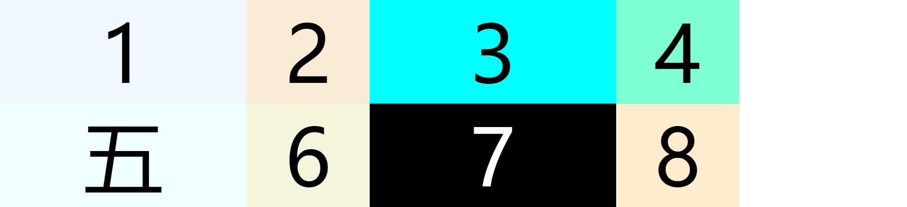
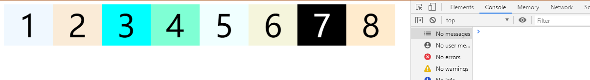

# grid 布局

## 基本概念

### 容器和项目

> 其中`container`就是容器.`item`就是项目.`grid`布局只对项目生效,`p`标签是会生效的,我理解的就是容器的直接子集才可以

```html
<div class="container">
	<div class="item item-1"></div>
	<div class="item item-2"></div>
	<div class="item item-3"></div>
	<div class="item item-4"><p>pppppp</p></div>
</div>
```

### 行和列

> 行 `row` 水平, 列 `column` 垂直

### 单元格

> 行和列的交叉区域,称之为单元格(cell)

- 正常情况下,`n`行 和 `m`列会产生`n * m`个单元格,例如: 3 \* 3 会产生 9 个单元格

### 网格线

> 划分网格的线,称为"网格线"(grid line). `n`行有`n + 1`根水平网格线, `m`列有`m + 1`列垂直网格线

## 容器属性

> 容器属性(也就是父元素的属性),

### display 属性

> `display: grid`指定一个容器采用网格布局

[点击这里查看](./html/grid1.html)


```txt
上图是`display:grid;`属性
```

默认情况下 **容器**是`块级元素`, 当然也可以设置为`行内元素`

[点击这里查看](./html/grid2.html)


```txt
上图是`display:inline-grid;`属性的效果
```

```txt
注意，设为网格布局以后，容器子元素（项目）的float、display: inline-block、display: table-cell、vertical-align和column-*等设置都将失效。
```

### grid-template-columns 属性和 grid-template-rows 属性

> 容器指定了是网格布局以后,就要划分行和列.

- `grid-template-columns` : 属性是用来定义每一列的列宽
- `grid-template-rows` : 属性是用来定义每一行的行高

```css
.container {
	display: grid;
	grid-template-columns: 50px 50px;
	grid-template-rows: 50px 50px;
}
```

[上面代码](./html/grid3.html)指定了一个两行两列的网格,网格的列宽和行高都是`50px`


> 上面的单位用的是`绝对单位(px)`,也可以用`相对单位(%,em,vw,vh...)`

[百分比](./html/grid4.html)

**注意**: 上面的行高我设置的是`50%`,但是展示的时候是按照元素内容的行高展示的.`控制台`信息`[Deprecation] Percentages row tracks and gutters for indefinite height grid containers will be resolved against the intrinsic height instead of being treated as auto and zero`(意思是说: 已经弃用的元素,不定高度的网格布局或者是百分比布局将根据固有的高度进行解析,而不是自动视为 auto 和 0)

#### repeat()

> 有时候重复写同样的值非常麻烦.这时,我们可以使用`repeat()`函数,简化重复的值

```css
.container {
	display: grid;
	grid-template-columns: repeat(2, 50%);
	grid-template-rows: repeat(2, 50%);
}
```

`repeat()`接受两个参数,第一个参数是重复的次数(上面是 2),第二个参数是所要重复的值.
`repeat()` 的第二个参数也可以是一种模式

```css
/* 重复两次,每次的第一列是 100px 第二列是50px */
grid-template-columns: repeat(2, 100px 50px);
```

[重复模式](./html/grid5.html)


**注意**: `绝对单位(px)`是没问题.但是如果是`相对单位(%)`那可能还是有点问题的

[百分比问题](./html/grid6.html)


```txt
设置的是百分比,百分比是根据父元素来设置的.
```

#### auto-fill 关键字

> 有时候,单元格的大小是固定的,但是容器的大小不确定.如果希望每一行(或每一列)容纳尽可能多的单元格,这时候可以用`auto-fill`关键字表示自动填充

```css
.container {
	display: grid;
	grid-template-columns: repeat(auto-fill, 100px);
}
```

[上面代码](./html/grid7.html)表示每列宽度 100px,然后自动填充,直到容器不能放置更多的列

上面的图片是容器的宽度比较大的时候

上面的图片是容器的宽度不够大的时候,`项目`会换行展示

#### fr 关键字

> 为了更方便的表示比例关系,网格布局提供了`fr`关键字,如果两列的宽度分别为 1fr 和 2fr，就表示后者是前者的两倍。

```css
.container {
	display: grid;
	grid-template-columns: 1fr 1fr 1fr;
}
```

[上面代码](./html/grid8.html)表示 3 个相同宽度的列


- `fr` 可以与绝对长度的单位结合使用,这时会非常方便

```css
.container {
	display: grid;
	grid-template-columns: 150px 1fr 2fr;
}
```

[上面代码](./html/grid9.html)表示第一个元素为`100px`的宽度,剩下的宽度分为 3 分,第二个元素占一份,第三个元素占两份.


#### minmax()
