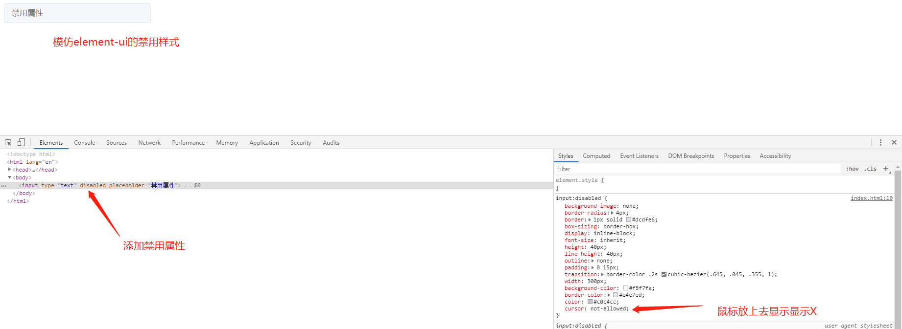

# 模仿element-ui禁用input属性

```css
input:disabled {
    background-image: none;
    border-radius: 4px;
    border: 1px solid #dcdfe6;
    box-sizing: border-box;
    display: inline-block;
    font-size: inherit;
    height: 40px;
    line-height: 40px;
    outline: none;
    padding: 0 15px;
    transition: border-color .2s cubic-bezier(.645, .045, .355, 1);
    width: 300px;
    background-color: #f5f7fa;
    border-color: #e4e7ed;
    color: #c0c4cc;
    cursor: not-allowed;
}
```

```html
<input type="text" disabled placeholder="禁用属性">
```


