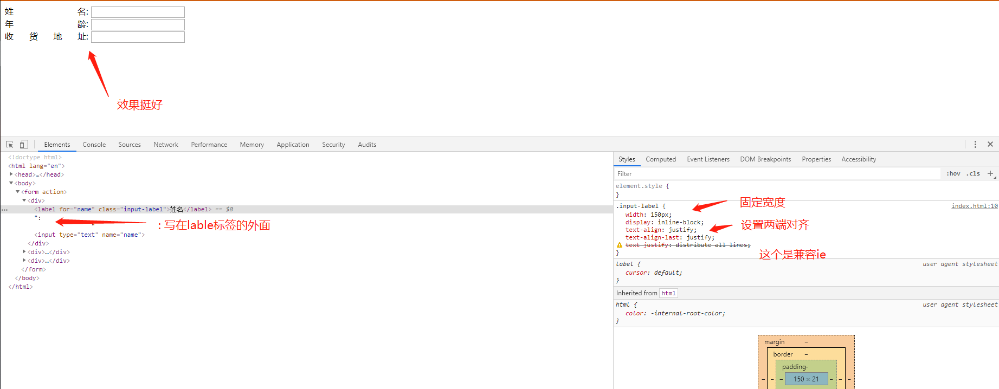

# 文字两端对齐

## html版本

```html
<form action="">
    <div>
        <label for="name" class="input-label">姓名</label>:
        <input type="text" name="name">
    </div>
    <div>
        <label for="age" class="input-label">年龄</label>:
        <input type="text" name="age">
    </div>
    <div>
        <label for="address" class="input-label">收货地址</label>:
        <input type="text" name="address">
    </div>
</form>
```

```css
.input-label {
    width: 150px;
    display: inline-block;
    /* 设置文字两端对齐:效果看是文字左边对齐 */
    text-align: justify;
    /* 设置文字两端对齐:效果看是文字右边对齐 */
    /* 一左一右刚好就是文字两端对齐中间平分 */
    text-align-last: justify;
    /* 下面这个是设置兼容ie */
    text-justify: distribute-all-lines;
}
```



## element-ui版

> 做不出来 `:` 也会当作文字两端对齐
> 我原本想调整行间距,但是`:`也会跟着调整行间距
> 我还没有特别好的思路,如果你可以做,请联系我
