# 总结

## el 总结

### upload 上传控件总结

上传的分类:

- 图片上传 (未作过)
- 文件上传 (未做过)
  - 选择文件上传(1 步操作)
  - 先选择文件,再上传到服务器(2 步操作)
- 上传头像 (未做过)
- 拖拽上传

#### 文件上传

> 用了一步上传也用了两步上传

#### 真实案例

> 项目 UI 图样子

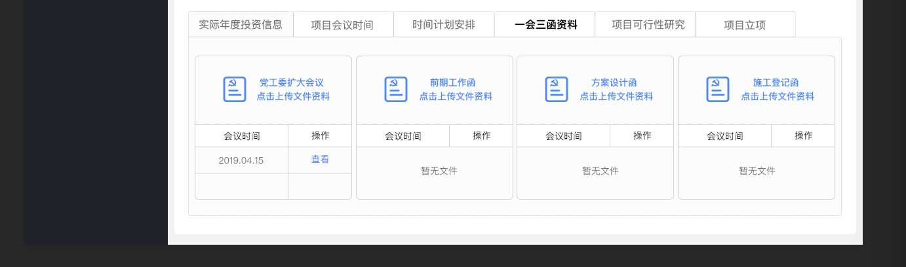

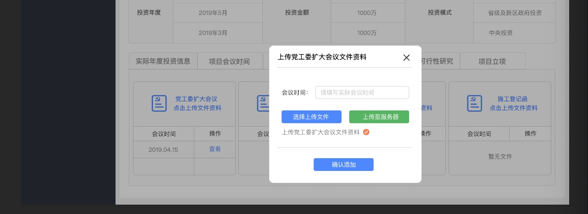

> 项目真实样子

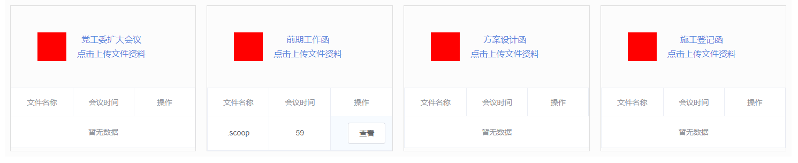

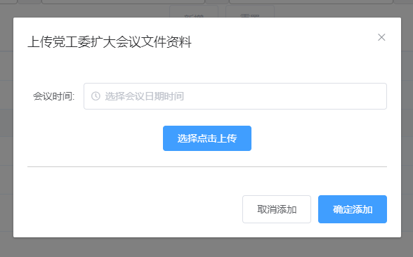

> 组件 HTML 整体结构

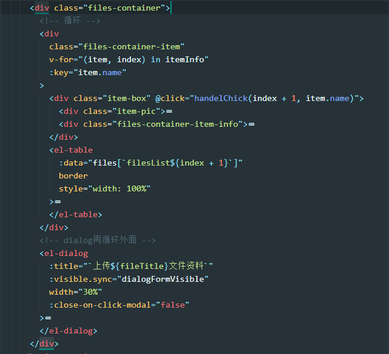

> 上图中 四个上传控件,看起来都基本一样是不是?但是还是有一些基本的区别

**具体实现**

`v-for`循环出来四个 div,进行排版,upload 组件就再循环里面,dialog 没有再循环里面,公用一个 dialog
点击其中一个就会出现一个 dialog,`title`要对应,

##### 难点 1: 需要传递给后台一个 id 来确保点击的哪一个盒子 (★★)

解决方案: 通过给盒子绑定事件传递参数的方式,这样我们就可以知道点击的是哪一个盒子

##### 难点 2: 循环出来的 el-table 表格绑定不了数据 (★★★★)

报错信息: :data 要求传递的是数组,目前传递的确实字符串
解决方案: 所有的循环表格的数据放到一个对象中去,再通过 :data="files[方式.j](./一会三函-循环 table 数]",这样就可以绑定属性
原理: 动态绑定时 中括号的方案
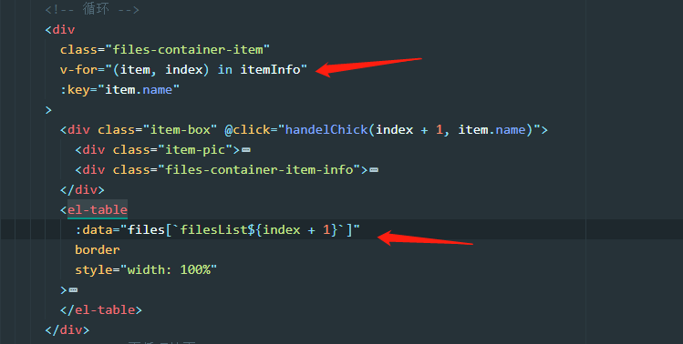

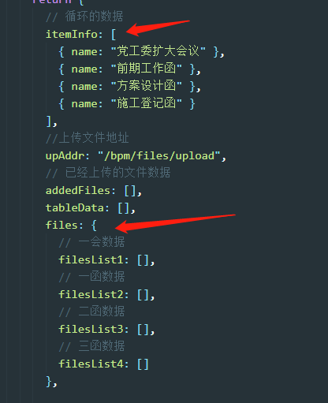

##### 难点 3: 点击某一个盒子的时候,点击弹出 dialog,title 对应 (★★)

解决方案: 用一个变量存储起来,然后动态绑定到 dialog 中
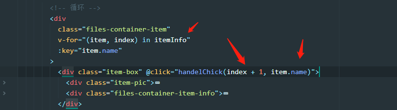
其中一个是循环的数据,上面曾有展示的呢,忘记了的小伙伴去上面看一下,
剩下的两个是点击弹出 dialog 的方法,参数 1 是`难点1`中的实现,参数 2 是`目前问题`的实现
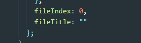

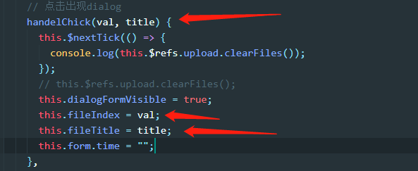
点击的时候获取到值,然后赋值给全局变量,这样就可以了.

##### 难点 4: 清空上次上传的数据

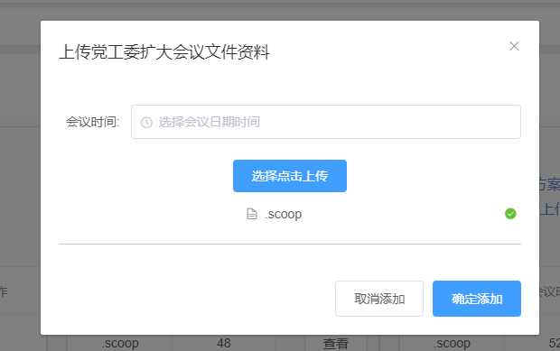
问题: 我目前已经上传了一次文件,上传完成后再次点击出现弹窗,上次选择的文件还残留再 dialog 弹窗中.

解决方案: 给 dialog 组件绑定一个`ref`属性(因为公用的是一个 dialog,所以绑定一个就可以了,如果是循环中的 dialog,那么就需要动态绑定 ref 属性),然后调用 elementUi 中的方法

如果没有`this.nextTick`那么是获取不到这个`ref`的,所以需要把这个方法存放在异步更新中,
如果写在`this.$nextTick()`的后面,也是不可以的,因为这个方法是异步更新,加载到下一行的时候,还没有更新完成.

#### 残留

目前我做的只能上传一个 文件 不允许上传多个文件
