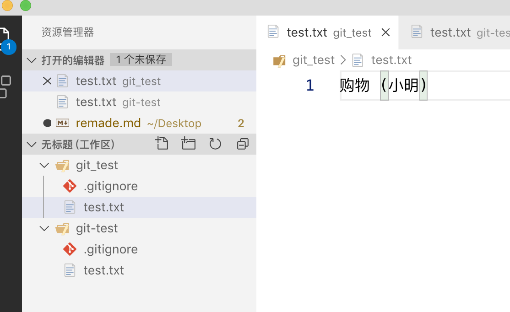
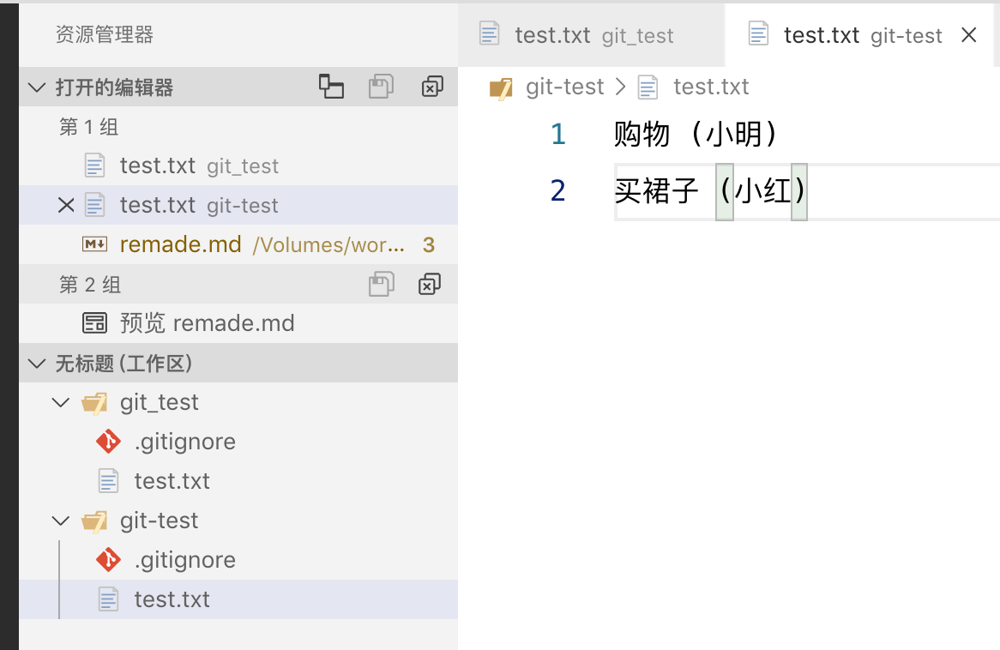
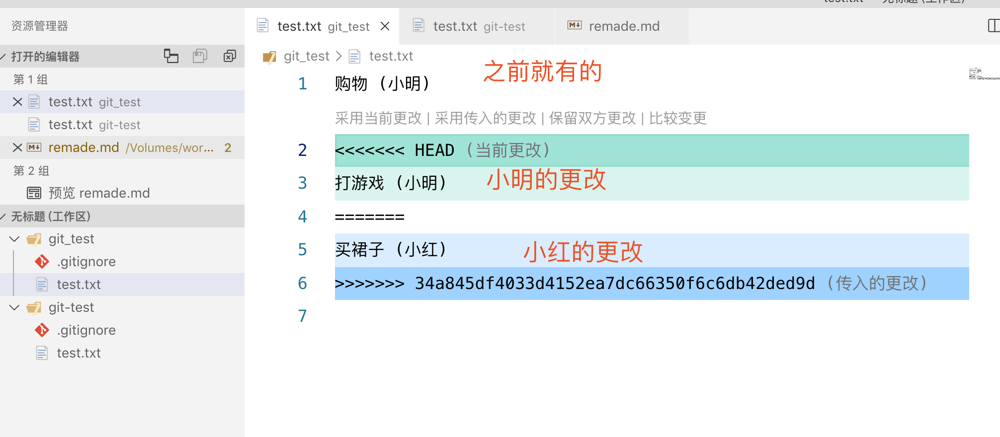
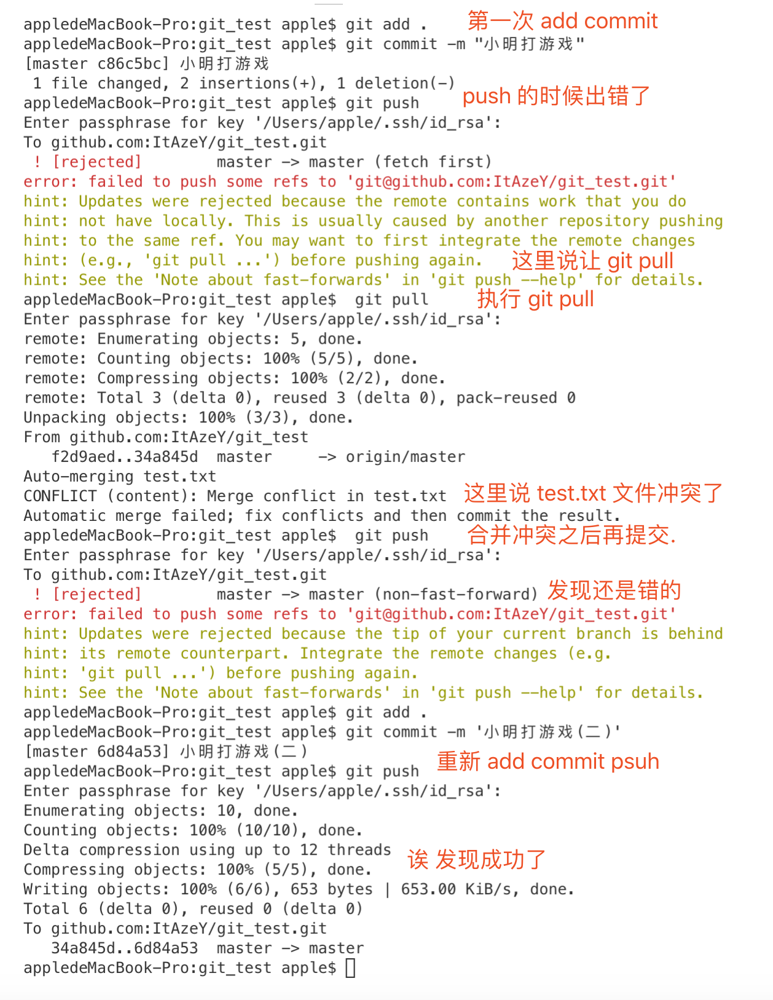

# git

## 获取 ssh

> 需要和 github 上面的邮箱关联在一起

```bash
ssh-keygen -t rsa -C "953463876@qq.com"
```

## 关联 github

> github 上面 settings 创建一个新的 ssh
> 把刚刚新创建的 ssh 填入到 `key` 中

### init

> 在本地的文件夹中 git init

### 添加远程仓库

> 如果有了远程仓库请先删除掉

```bash
git remote add origin git@github.com:ItAzeY/md.git
```

### pull 代码

> 先把仓库的代码拉取到本地

```git
git pull --rebase origin master
```

### 提交

> add . 只能对已经受 git 管理的文件进行提交

```git
git add <文件名>
git add .
```

### commit

> -m 应该就是 master 分支的意思

```git
git commit -m "提交的信息名称"
```

### push 代码

> 第一次提交的时候需要加上`-u`,以后就不需要哦

```git
git push -u origin master
```

### 查看远程仓库

> 有的时候我们想查看,当前远程仓库的地址

```Bash
# 列出已经存在的远程分支
git remote
# 列出详细信息,在每一个名称后面有远程仓库的url
git remote -v | --verbose
```

### 删除远程仓库

> git 管理得文件夹已经关联了 github 远程仓库,
> 此时我想要把这个文件夹关联到别的 github 远程仓库

```Bash
git remote rm origin
```

## 分支

### 创建分支

```Bash
# 创建 dev 分支
git branch dev
```

### 切换分支

```Bash
# 切换到 dev 分支
git checkout dev
```

### 创建并切换分支

```Bash
# 创建 dev 分支,并切换到 dev 分支
git checkout -b dev
```

### 查看分支

```Bash
# 查看分支
# 前面带(*)号的就是当前分支
git branch
# 查看远程分支
git branch -r
# 查看所有分支
git branch -a
```

### 删除本地分支

```BASH
git branch -d test
# 删除 test 分支
```

### 删除远程分支

```Bash
# 删除远程的 dev 分支
git push origin :heads/dev
# 这一种更好一些,上面的会 push 一次
git push origin --delete <BranchName>
```

```Bash
# 删除本地的 dev 分支
# -d选项只能删除已经参与了合并的分支
# -D强行删除一个分支
git branch -d dev
git branch -D dev
```

### 合并分支

```Bash
# 将 dev 分支与当前分支进行合并
git merge dev
```

### cherry-pick

假设,我在 `test` 分支上一共有 3 次`commit`,要把前面两次的`commit`合并到`master`分支上面.

```bash
# 先切换到要合并到的目标分支上面
git checkout master
# 合并
git cherry-pick -n <版本号>
```

### 创建远程分支

```Bash
# 在远程创建 dev 分支
git push origin dev
```

### 回退到合并前的状态

```bash
# 当你合并分支的时候发现冲突了,不要慌张,此时我们可以回退到合并前的状态
git reset --hard
# 或者
git merge --abort
```

### 忽略文件

> 在`git`管理仓库的根目录下创建一个`.gitignore`文件,在里面写上需要忽略的文件

```txt
# Xcode
.DS_Store
*/build/*
*.pbxuser
!default.pbxuser
*.mode1v3
!default.mode1v3
*.mode2v3
!default.mode2v3
*.perspectivev3
!default.perspectivev3
xcuserdata
profile
*.moved-aside
DerivedData
.idea/
*.hmap
*.xccheckout
*.xcworkspace
!default.xcworkspace
.look

#CocoaPods
Pods
!Podfile
!Podfile.lock
```

### 分支提交

> 当你在分支里面修改了代码,需要先 `add` 再 `commit`,不然你是切换不了分支的

## 三大区

1. 工作区
2. 暂存区
3. 版本区

### 添加到暂存区

```Bash
# 将所有被追踪的文件添加到暂存区
git add .
```

### 删除暂存区的文件

```Bash
# 撤销所有
git reset HEAD -- .
# 撤销单独的文件
git reset HEAD -- <test.txt> 撤销特定目标
```

### 删除版本区的文件

```js
//仅仅只是撤销已提交的版本库，不会修改暂存区和工作区
git reset --soft 版本库ID
//仅仅只是撤销已提交的版本库和暂存区，不会修改工作区
git reset --mixed 版本库ID
//彻底将工作区、暂存区和版本库记录恢复到指定的版本库
git reset --hard 版本库ID
```

### 删除暂存区和工作区的文件

```js
// 工作区的文件也会被删除
git rm -f 文件名
```

## head

head: 在我看来就是一个指针,指向当前的分支,而当前的分支会有一个版本号,指向与当前的 commit.

## 回滚版本

```bash
git reset --hard <版本号,也就是 commit 的很长的值>
```

## branch

分支

如果没有创建分支的话,默认就是`master`分支(主分支),如果这时我们 `commit`,指针`(HEAD)` 就会带着 当前的分支`(master)` 一起指向最新的 `commit`

## master

主分支

当创建一个仓库的时候,默认会有一个`master`分支.并把`HEAD`指向这个`master`分支

当有人`git clone`这个仓库时,除了会把文件下载,还会`checkout` （签出） `master`（`checkout` 的意思就是把某个 `commit` 作为当前 `commit`，把 HEAD 移动过去，并把工作目录的文件内容替换成这个 `commit` 所对应的内容）。

你从 github 上面 clone 代码的时候知会 clone master 分支.不知道怎么 clone 子分支.

如果代码上面有一个`master`分支和一个`test`分支,要 `clone` test 分支怎么做?

```bash
git clone -b test <地址>
#  -b 就是分支的意思. test 要 clone 的分支名称
```

## push

`push` 是把当前的分支上传到远程仓库，并把这个 `branch` 的路径上的所有 `commit` 也一并上传

`push` 的时候，如果当前分支是一个本地创建的分支，需要指定远程仓库名和分支名，用 `git push origin <名称>` 的格式，而不能只用 `git push`；

`push` 的时候之后上传的是当前分支，并不会上传 `HEAD`；远程仓库的 `HEAD` 是永远指向默认分支（即 `master`）的。

## pull

git pull 的「两步走」—— git fetch 下载远端仓库内容时，origin/master 和 origin/HEAD 移动到了最新的 commit。第二步操作 merge 的目标 commit ，是远端仓库的 HEAD，也就是 origin/HEAD ，git merge origin/HEAD

## 切换到主分支并创建新分支并切换到这个分支

```bash
git checkout -b newbranch origin/master
# 基于远程的 master 分支创建一个 newbranch,并切换到这个分支
```

## log

查看commit 的历史

```bash
git log
```

`git log` 还会有一些额外的参数

```bash
# 仅仅输出commit hash 前7个字符串和commit message.
git log --oneline
# git log 的基础上输出文件增删改的统计数据
git log --stat
# 限定数量
git log -2
# 控制输出每个commit具体修改的内容，输出的形式以diff的形式给出。
git log -p
# 显示当前指定的版本信息 还可以指定版本
git show <版本>
# 用来输出汇总信息，以作者进行分类。
git shortlog
# 可以用来统计每个作者的commit数量
git shortlog -s
# 可以用来对统计的量进行倒序排列
git shortlog -n
# 输出指定 用户 的 commit
git log --author="itAzeY"
# 显示 merge 的 commit
git log --merges
# 不显示 merge 的 commit
git log --no-merges
# 显示从 2019 年 10 月 01 号之后的内容
git log --after '01-10-2019'
# 显示从 2019 年 10 月 10 号之前的内容(当前这条测试是 01-10-2019 做的,如果用 beofre,必须设置为 10号 以后才会有)
git log --before '10-10-2019'
```

## rebase

`rebase`在某些`GUI git`工具上汉化翻译为“衍合”

使用场景是: 我开个新分支来开发新需求，这中间有紧急bug fix或者别的什么修改在主分支上进行了，我需要把这些改动同步到新分支来，但是我暂时不想把这个分支合并到主分支，因为的新需求还没开发完呢，咋办呢，用`衍合(rebase)`。

换种说法也可以：我在主分支commit a时新建了新分支，此时开始分叉，分叉后我又在主分支改了东西commit b，此时我后悔了，我不该在commit a时分叉的，因为commit b的东西我新分支也需要，此时用衍合，就等于我丢弃原分叉，在commit b重新分叉（原分叉的改动内容当然也是带上的，没有丢）

```bash
# 在分支的位置进行 rebase
git rebase master
# 然后在回到 master 分支,进行 merge
git checkout master
git merge <当前分支>
git push
# 回退 rebase 之前的版本
git rebase —abort
```

## Commit

git commit --amend

当上次`commit`的时候,里面有几个错别字,因为有几个错别字,难道我们就在修一次再次 `commit` 么?
这样就太浪费我们的记录吧,所以就有了`git commit --amend`

`commit --amend` 并不是直接修改原 `commit`，而是重新生成一个新的 `commit`，并替换掉旧的 `commit`(为什么是替换不是修改呢?是因为每次的版本号不一样了呢)

## 分支冲突

远程代码:
	test.txt

小明: 先把代码拉取下来(文件名称为 git_test)
小红: 也把代码拉取下来(文件名称为 git-test)

小明对`test.txt`文件做修改,添加 `购物`

小红`git pull` 下来和小明的代码一致.
这样是没问题,小明和小红不操作同一个文件

小明 commit 代码到他的本地，并 push 到 GitHub 中央仓库
小红把 GitHub 的新提交通过 pull 指令来取到本地

通过这个流程，小明和小红就可以简单地合作了：小明写了代码，commit，push 到 GitHub，然后小红 pull 到她的本地；小红再写代码，commit, push 到 GitHub，然后小明再 pull 到他的本地。你来我往，配合得不亦乐乎.

但是，这种合作有一个严重的问题：同一时间内，只能有一个人在工作。小明和小红其中一个人写代码的时候，另一个人不能做事，必须等着他把工作做完，代码 push 到 GitHub 以后，自己才能把 push 上去的代码 pull 到自己的本地。而如果同时做事，就会发生冲突：当一个人先于另一个人 push 代码（这种情况必然会发生），那么后 push 的这个人就会由于中央仓库上含有本地没有的提交而导致 push 失败。

**模拟**

小红现在给`text.txt`文件添加一条`买裙子`


然后通过 add commit push 操作提交到 Github.

然而 此时呢,小明也给`text.txt`文件添加一条`打游戏`的记录,
小明这时候不知道小红改动了代码,所以直接就用 push 来提交代码

此时: 小明 push 的时候,会爆一个错误,具体的错误信息为,无法更新到 github 地址,由于 GitHub 的远端仓库上含有本地仓库没有的内容，所以这次 push 被拒绝了.
小明一看没成功?让 git pull?那就 git pull 呗,也没事.嗯 成功了.看起来没问题.回到 `test.txt` 文件看一下



呀!冲突了.要合并冲突.

```txt
购物 (小明)
打游戏 (小明)
买裙子 (小红)
```
嗯 好了.这次应该就可以 push 了吧.诶?怎么还是和之前一样啊.不让我提交.
是不是因为我保存了文件,没有重新 add commit?我们试一下来

耶! 终于成功了.来看下小明的 git 信息吧



当我们调用 git log 的时候

会发现 `小明打游戏` 和 `小明打游戏(二)` 都在 commit 记录里面呢
