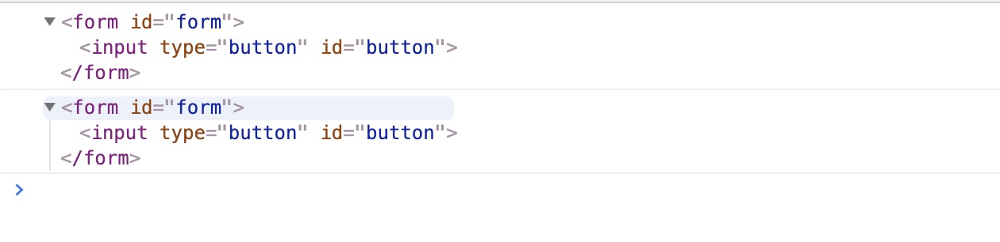

# input 标签

想看 input 的属性,请 [点击](#通用属性)

## type

| 类型                              | 描述                                                                       |
| :-------------------------------- | -------------------------------------------------------------------------- |
| [text](#text)                     | 定义单行的输入字段，用户可在其中输入文本。默认宽度为 `132px`,高度为 `21px` |
| [button](#button)                 | 定义可点击按钮                                                             |
| [checkbox](#checkbox)             | 定义复选框。                                                               |
| [color](#color)                   | 定义输入字段和 "浏览"按钮，供文件上传。                                    |
| [date](#date)                     |
| [datetime](#datetime)             |
| [datetime-local](#datetime-local) |
| [email](#email)                   |
| [file](#file)                     |
| [week](#week)                     |
| [month](#month)                   |
| [url](#url)                       |
| [time](#time)                     |
| [tel](#tel)                       |
| [submit](#submit)                 | 定义提交按钮。提交按钮会把表单数据发送到服务器。                           |
| [search](#search)                 |
| [reset](#reset)                   | 定义重置按钮。重置按钮会清除表单中的所有数据。                             |
| [radio](#radio)                   | 定义单选按钮。                                                             |
| [range](#range)                   |
| [password](#password)             | 定义密码字段。该字段中的字符被掩码。                                       |
| [number](#number)                 |
| [image](#image)                   | 定义图像形式的提交按钮。                                                   |
| [hidden](#hidden)                 | 定义隐藏的输入字段。                                                       |

### text

> `value`设置或返回在按钮上显示的文本。

### button

> 设置`input`为 `Button` 对象
> `value`设置或返回在按钮上显示的文本。

支持的属性:

1.  accessKey
1.  alt
1.  disabled
1.  form
1.  id
1.  name
1.  tabIndex
1.  type
1.  value
1.  dir
1.  lang
1.  title

### image

#### align 属性

属性值:

| 属性值 | 描述                 |
| :----- | -------------------- |
| left   | 左对齐图像（默认）。 |
| right  | 右对齐对象。         |
| top    | 上对齐图像。         |
| middle | 居中对齐图像。       |
| bottom | 下对齐图像。         |

这个属性是只能与`type=image`配合使用.它规定图像输入相对于周围其他元素的对齐方式。只有 "left" 和 "right" 值得到所有浏览器的支持。属于`HTML5`的属性.

在 HTML 4.01 中，不赞成使用 input 元素的 align 属性。在 XHTML 1.0 Strict DTD 中不支持该属性。
请使用 CSS 代替。
CSS 语法：`<input type="image" style="float:right" />`

[实例代码](./html/align属性.html).

### checkbox

- `defaultChecked`: 返回 checked 属性的默认值。
- `checked` : 设置或返回 checkbox 是否应被选中。
- `disabled` : 设置或返回 checkbox 是否应被禁用。

1. 唯一要说的就是获取 `复选框(checkbox)`的值.
2. 通过 `document.getElementsByName()` 来获取对应的元素数组.
3. 然后遍历这个数组.取出元素`checked = true` 的元素

```html
<body>
	<input type="checkbox" name="test" value="1" />1<br />
	<input type="checkbox" name="test" value="2" />2<br />
	<input type="checkbox" name="test" value="3" />3<br />
	<input type="checkbox" name="test" value="4" />4<br />
	<input type="button" value="获取" id="button" onclick="showCheck()" />
	<script>
		var tests = document.getElementsByName("test")
		function showCheck() {
			var check_val = []
			for (var i = 0; i < tests.length; i++) {
				if (tests[i].checked) {
					check_val.push(tests[i].value)
				}
			}
			console.log(check_val)
		}
	</script>
</body>
```

[上面代码](./html/checkbox.html)中,当点击获取的时候,就可以得到选中的多选框的值

> 多选框

### color

HTML5 的新对象
`Color` 对象表示 `HTML <input type="color">` 元素。
<span style="color:red;">注意:</span>color 对象不支持`IE`浏览器

动态创建一个`color`对象:

```js
var x = document.createElement("input")
x.setAttribute("type", "color")
```

属性 :

- `autocomplete`: 设置或返回色彩选择器的 autocomplete 属性值。
- `autofocus` : 设置或返回色彩选择器在页面加载后是否应自动获取焦点。
- `defaultValue` : 设置或返回色彩选择器的默认值。
- `disabled` : 设置或返回色彩选择器是否被禁用。

## 通用属性

| 属性                    | 描述 |
| :---------------------- | ---- |
| [accessKey](#accessKey) |
| [alt](#alt)             |
| [disabled](#disabled)   |
| [form](#form)           |
| [tabIndex](#tabIndex)   |

### accessKey

accesskey 属性规定激活（使元素获得焦点）元素的快捷键。
**注释**：以下元素支持 accesskey 属性：`<a>, <area>, <button>, <input>, <label>, <legend> 以及 <textarea>`。

**注释**：请使用 Alt + accessKey 为拥有指定快捷键的元素赋予焦点。

各种浏览器下 accesskey 快捷键的使用方法
`IE 浏览器`

按住 Alt 键，点击 accesskey 定义的快捷键(焦点将移动到链接)，再按回车.

`FireFox 浏览器`

按住 Alt+Shift 键，点击 accesskey 定义的快捷键.

`Chrome 浏览器`

按住 Alt 键，点击 accesskey 定义的快捷键.

`Opera 浏览器`

按住 Shift 键，点击 esc，出现本页定义的 accesskey 快捷键列表可供选择.

`Safari 浏览器`

按住 Alt 键，点击 accesskey 定义的快捷键.

### alt

设置或返回当浏览器无法显示按钮时供显示的`替代文本`。

### disabled

`disabled` 属性可设置是否禁用按钮。

### form

`form`属性用于设置 input 元素属于哪个表单。在`html4`中，表单中的所以元素都必须在这个表单的开始标签和结束标签之间，而在`html5`中，如果要将表单开始和结束标签之外的元素归属到该表单，只需要设置`form`属性与`form`标签的`id`属性对应

这只是其中的一个功能,第二个功能就是,你可以通过当前的 `input` 标签获取到他属于哪一个 `form`表单

```html
<form id="form">
	<input type="button" id="button" />
</form>
<input type="text" form="form" id="input" />
<script>
	var button = document.querySelector("#button")
	var input = document.querySelector("#input")
	console.log(button.form)
	console.log(input.form)
</script>
```

[案例](./html/form属性.html)中,两个`input`元素同属于`form`这个表单,都可以获取到这个`form`表单标签,但是被`form`展示不同是一个里面有这个元素,另一个里面没有这个元素


**注意:** 如果没有设置`form`属性,并且没有被`form`标签包裹,则会返回`null`

### tabIndex

- 带有指定 `tab` 键顺序
- 几乎所有浏览器均 `tabindex` 属性，除了 `Safari`。
- `tabindex` 属性规定元素的 `tab` 键控制次序（当 `tab` 键用于导航时）
- 以下元素支持 `tabindex` 属性：`<a>, <area>, <button>, <input>, <object>, <select> 以及 <textarea>`。
- `Number`类型 : 规定元素的 `tab` 键控制次序（1 是第一个）。

### name

- 可以和后台交互
- `input` 单选框
- 建立`a`标签的页面锚点
- 在 IMG 元素和 MAP 元素之间关联的时候，如果要定义 IMG 的热点区域，需要使用其属性 usemap，使 usemap="#name"(被关联的 MAP 元素的 Name)
- `var input = document.createElement('<INPUT name="myName">')`动态创建标签 `name` 赋值
- document.getElementsByName()

### id

选择器用???(我是这么想的)

### dir

- dir 属性规定元素内容的文本方向。
- dir 属性在以下标签中无效：`<base>, <br>, <frame>, <frameset>, <hr>, <iframe>, <param> 以及 <script>`。
- 所有浏览器均支持 dir 属性。
- `<element dir="ltr|rtl">`

我怎么感觉有时候可以用这个代替浮动呢

| 属性值 | 描述                       |
| :----- | -------------------------- |
| ltr    | 默认。从左向右的文本方向。 |
| rtl    | 从右向左的文本方向。       |
