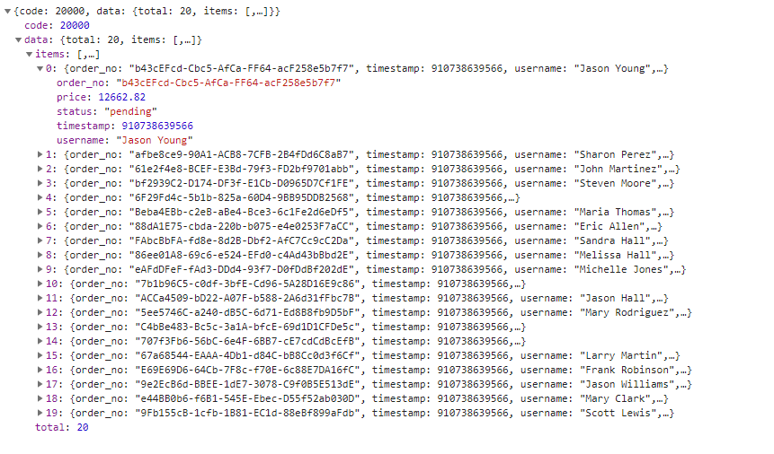
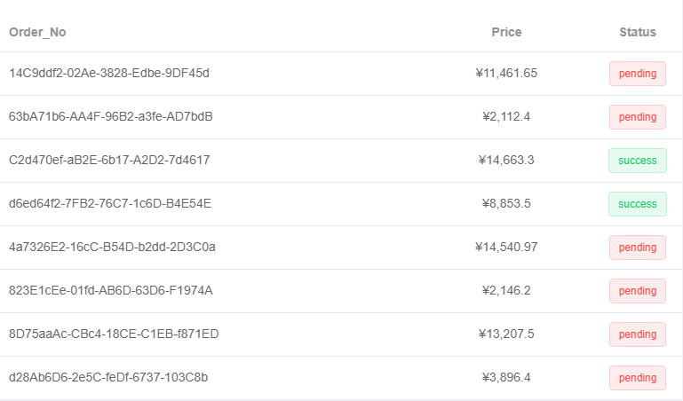

# 分析

## 目录结构

> 重点再 90 行 [点击传送](#重点)

```·
📦dashboard               // src下的 views下的首页
 ┣ 📂admin                // admin组件
 ┃ ┣ 📂components
 ┃ ┃ ┣ 📂TodoList
 ┃ ┃ ┃ ┣ 📜index.scss
 ┃ ┃ ┃ ┣ 📜index.vue
 ┃ ┃ ┃ ┗ 📜Todo.vue
 ┃ ┃ ┣ 📜BarChart.vue
 ┃ ┃ ┣ 📜BoxCard.vue
 ┃ ┃ ┣ 📜LineChart.vue
 ┃ ┃ ┣ 📜PanelGroup.vue
 ┃ ┃ ┣ 📜PieChart.vue
 ┃ ┃ ┣ 📜RaddarChart.vue
 ┃ ┃ ┗ 📜TransactionTable.vue   // 这个就是我们今天分析的主角
 ┃ ┗ 📜index.vue          // admin 默认展示的index页面, 主角就再这里面
 ┣ 📂editor               // 编辑组件
 ┃ ┗ 📜index.vue
 ┗ 📜index.vue            // 权限 控制展示哪一个组件
```

### TransactionTable.vue

> 调用接口

- `@`默认是`src`文件夹 ----> `src/api/remoteSearch`
- 获取`transactionList`这个方法

```js
import { transactionList } from "@/api/remoteSearch"
```

- 接口地址是`/transaction/list`
- 请求方式是`get`
- 参数是`query`
- 今天咱们的主角并没有传参

```js
export function transactionList(query) {
	return request({
		url: "/transaction/list",
		method: "get",
		params: query
	})
}
```

- 首页下面的表格
- 进入页面调用接口截取数据并赋值给 list

```js
data() {
  return {
    list: null
  }
},
created() {
  this.fetchData()
},
methods: {
  fetchData() {
    transactionList().then(response => {
      this.list = response.data.items.slice(0, 8)
    })
  }
}
```



> 过滤器

- `scope.row` 是每一条数据
- `orderNoFilter` 是定义好的过滤器

<!-- 对字符串截取只要前三十 -->

```html
<template slot-scope="scope">
	{{ scope.row.order_no | orderNoFilter }}
</template>
```

### 重点

> 过滤器

- `slot-scope="{row}"` 是从当前这条数据里面解构出 `row`
- 主角对返回的数据进行过滤动态绑定 `<el-tag>` 标签 type 类型.

以后我们就可以使用这种方式或者这种思路来进行开发

```html
<template slot-scope="{row}">
	<el-tag :type="row.status | statusFilter">{{ row.status }}</el-tag>
</template>
```

```js
filters: {
  statusFilter(status) {
    const statusMap = {
      success: 'success',
      pending: 'danger'
    }
    return statusMap[status]
  },
  orderNoFilter(str) {
    return str.substring(0, 30)
  }
},
```

> 全局过滤器
> 主角并没有定义这个过滤器,那么肯定就是全局的过滤器

<!-- 对数据进行正则匹配并返回( price: 12662.82 ----> ¥12,662.82) -->

```html
<template slot-scope="scope">
	¥{{ scope.row.price | toThousandFilter }}
</template>
```

```js
export function toThousandFilter(num) {
	return (+num || 0).toString().replace(/^-?\d+/g, m => m.replace(/(?=(?!\b)(\d{3})+$)/g, ","))
}
```

- 再`main.js`中把全局的定义好的`filters`引入
- `* as filters` 是把这个文件定义一个变量方便管理
- `filters` 是一个对象,里面是`filters`文件写好的`函数`
- 通过`Object.keys()`传入`filters`来把每一个`函数`都挂载到`vue`的过滤器中
- 这样所有的组件都可以使用.今天的主角就是这样用的

```js
import * as filters from "./filters" // global filters
Object.keys(filters).forEach(key => {
	Vue.filter(key, filters[key])
})
```

### 最终展示

> 说了这么多我们还没有看看今天的主角是什么样子呢\
> 快来让我们看一看它吧~


