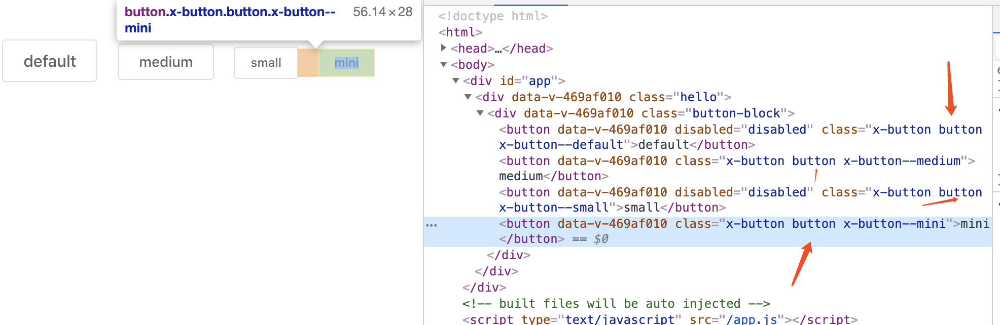
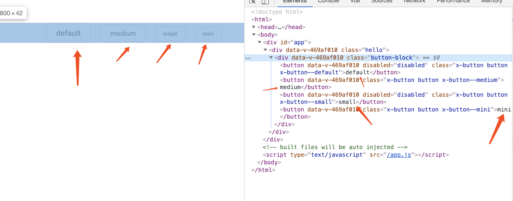
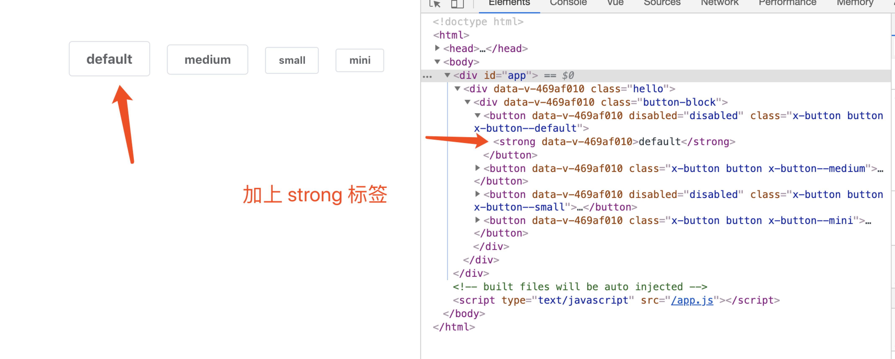
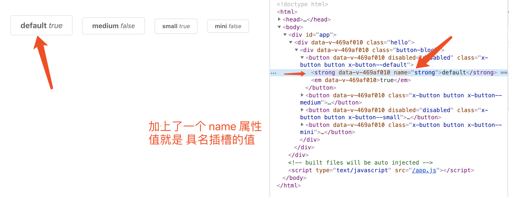
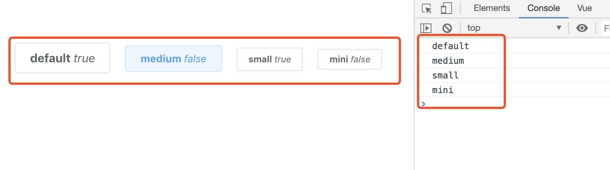
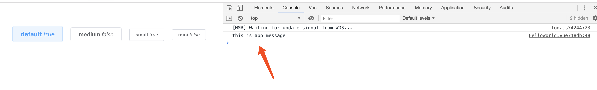

# vue.js 组件精讲

## 基础: vue.js 组件的三个 API:prop,event,slot

### 组件的构成

一个再复杂的组件,都是由三部分组成的: `prop`,`event`,`slot`,它们构成了 Vue.js 组件的 API,如果开发的是一个通用组件,那一定要事先设计好这三部分.因为组件一旦发布，后面再修改 API 就很困难了，使用者都是希望不断新增功能，修复 bug，而不是经常变更接口。如果你阅读别人写的组件，也可以从这三个部分展开，它们可以帮助你快速了解一个组件的所有功能。

### prop

> 我理解的就是组件的属性,属性可以是父组件传递过来的,也可以是自己的.

- 尽量使用`对象`的写法
- 这样可以设置每个属性的`类型` `默认值` `自定义校验属性`
- 单项数据流,只能通过父级来修改,组件自己不能修改
- 如果非要修改,需要通知父级来修改

我们来封装一个 `button` 组件

```html
<template>
	<button :class="'x-button--' + size" class="x-button" :disabled="disabled">{{size}}</button>
</template>

<script>
	function valuesOf(value, validList) {
		for (let i = 0; i < validList.length; i++) {
			if (value === validList[i]) {
				return true
			}
		}
		return false
	}
	export default {
		name: "xButton",
		props: {
			size: {
				validator(val) {
					return valuesOf(val, ["small", "medium", "mini", "default"])
				},
				default: "medium"
			},
			disabled: {
				type: Boolean,
				default: false
			}
		}
	}
</script>
```

使用组件:

```html
<x-button
	v-for="item of sizeList"
	:key="item.name"
	:size="item.name"
	:disabled="item.disabled"
></x-button>
```

组件中定义了两个属性：尺寸 size 和 是否禁用 disabled。其中 size 使用 validator 进行了值的自定义验证，也就是说，从父级传入的 size，它的值必须是指定的 small、large、default 中的一个，默认值是 default，如果传入这三个以外的值，都会抛出一条警告。

在使用组件时，也可以传入一些标准的 html 特性，比如 id、class：

```html
<x-button
	v-for="item of sizeList"
	:key="item.name"
	:size="item.name"
	:disabled="item.disabled"
	class="button"
></x-button>
```

这样的 html 特性，在组件内的 `<button>`元素上会继承，并不需要在 props 里再定义一遍。这个特性是默认支持的，如果不期望开启，在组件选项里配置 `inheritAttrs: false` 就可以禁用了。



> 我理解的就是当你使用组件的时候,在组件上面传递`class` `id`等属性,子组件就会继承父组件的类名

### slot 插槽

> 如果要给上面的按钮组件 `<i-button>` 添加一些文字内容，就要用到组件的第二个 `API`：插槽 `slot`，它可以分发组件的内容，比如在上面的按钮组件中定义一个插槽：

```html
<template>
	<button :class="'x-button--' + size" class="x-button" :disabled="disabled">
		<slot></slot>
	</button>
</template>
```

父组件中的使用:

```html
<x-button
	v-for="item of sizeList"
	:key="item.name"
	:size="item.name"
	:disabled="item.disabled"
	class="button"
>
	{{item.name}}
</x-button>

<x-button
	v-for="item of sizeList"
	:key="item.name"
	:size="item.name"
	:disabled="item.disabled"
	class="button"
>
	<strong>{{item.name}}</strong>
</x-button>
```




#### 具名插槽

> 我理解的就是当给 `slot` 设置一个名字,再使用组件的时候传入对应的`name` 属性值,就可以了

使用如下:

```html
<button :class="'x-button--' + size" class="x-button" :disabled="disabled">
	<slot name="strong"></slot>
	<slot></slot>
</button>
```

```html
<x-button
	v-for="item of sizeList"
	:key="item.name"
	:size="item.name"
	:disabled="item.disabled"
	class="button"
>
	<strong name="strong">{{item.name}}</strong>
	<em>{{item.disabled}}</em>
</x-button>
```



#### slot 默认内容

> 在组件的 `<slot>` 里也可以写一些默认的内容，这样在父级没有写任何 slot 时，它们就会出现，比如：

```html
<slot>提交</slot>
```

### event 自定义事件

> 现在我们给组件加一个点击事件，目前有两种写法,

#### 第一种

- 给子组件加上一个点击事件,并加上方法

```html
<button
	:class="'x-button--' + size"
	class="x-button"
	:disabled="disabled"
	@click="handleClick(size)"
>
	<slot name="strong"></slot>
	<slot></slot>
</button>
```

```js
handleClick(data) {
	this.$emit("on-click", data)
}
```

- 在父级通过 `@on-click` 来监听

```html
<x-button
	v-for="item of sizeList"
	:key="item.name"
	:size="item.name"
	class="button"
	@on-click="handleClick"
>
	<strong name="strong">{{item.name}}</strong>
	<em>{{item.disabled}}</em>
</x-button>
```

```js
handleClick (e) {
	console.log(e)
}
```



#### 第二种

先看下代码吧

和子组件完全没关系,只是父组件中定义方法和事件,然后加上`native`修饰符

```html
<x-button
	v-for="item of sizeList"
	:key="item.name"
	:size="item.name"
	class="button"
	@click.native="handleClick(item.name)"
>
	<strong name="strong">{{item.name}}</strong>
	<em>{{item.disabled}}</em>
</x-button>
```

```js
handleClick (e) {
	console.log(e)
}
```

效果是和上面是一样.我不是很清楚对不对.


如果不写 `.native` 修饰符，那上面的 `@click` 就是自定义事件 `click`，而非原生事件 `click`，但我们在组件内只触发了 `on-click` 事件，而不是 `click`，所以直接写 `@click` 会监听不到。

### 组件的通讯

- `ref`给组件或者元素注册引用信息
- `$parent/$children`: 访问父/子实例
- 通过`$emit`: 父子通讯
- `bus`: 任意实例通讯
- `vuex`: 仓库
- `provide/inject`: 注入依赖

## provide/inject 注入依赖

在父组件中设置依赖,在子组件中注入依赖

父组件(app.vue)中的设置:

```js
provide () {
	return {
		app: this
	}
},
data () {
	return {
		msg: 'this is app message'
	}
}
```

子组件中的设置:

```js
inject: ["app"],
mounted () {
	console.log(this.app.$data.msg)
}
```



> 你看我们可以调用 app.vue 组件中方法和属性

> provide 和 inject 绑定并不是可响应的。这是刻意为之的。然而，如果你传入了一个可监听的对象，那么其对象的属性还是可响应的。

> 上面的属性是可响应的,因为是监听的对象
